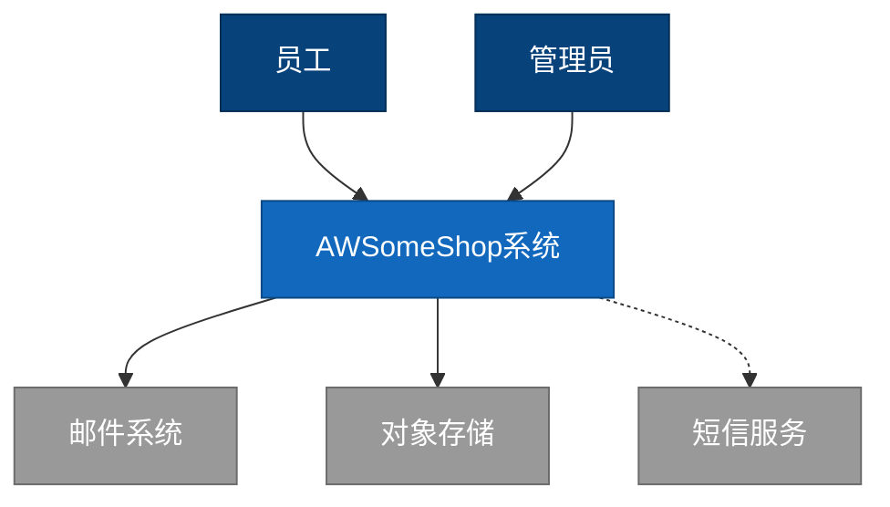
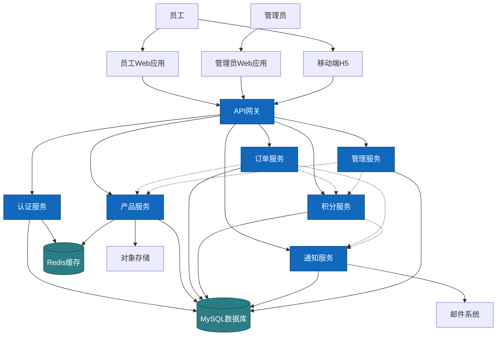
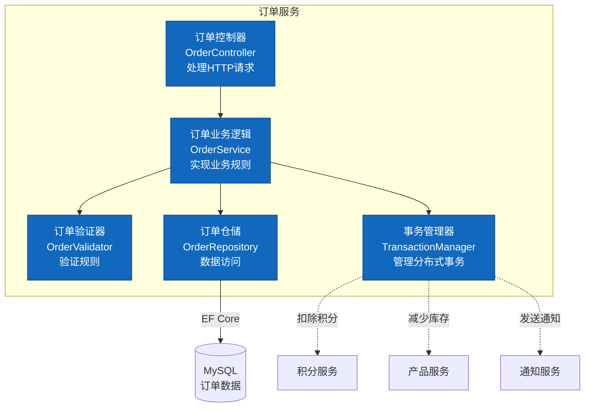
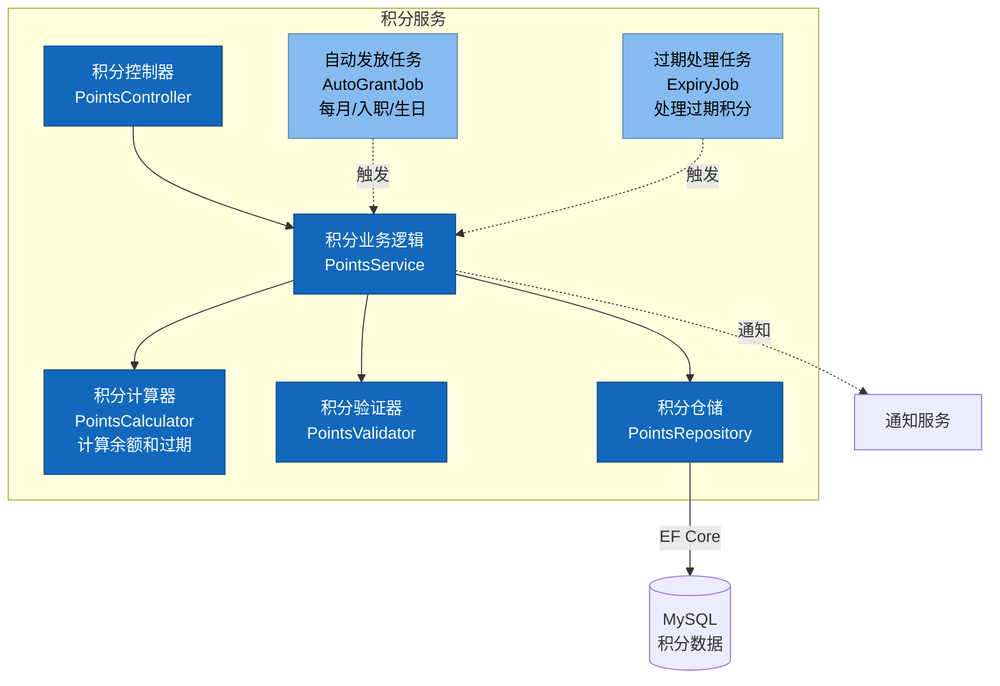
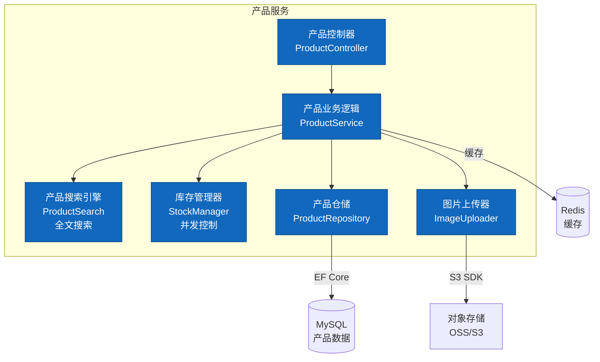
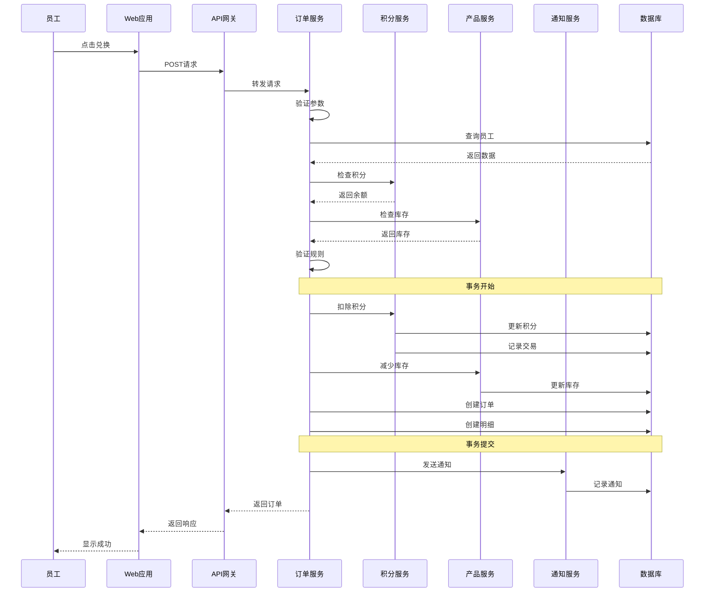
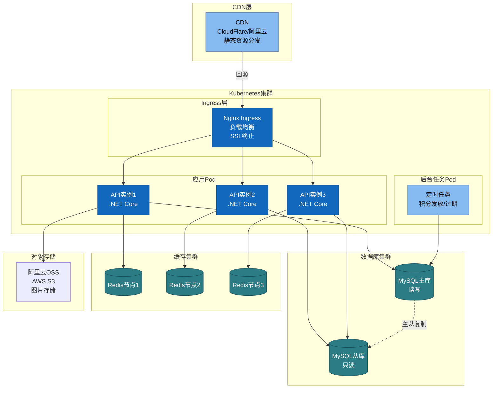

# AWSomeShop 架构图

本文档使用C4模型思想描述AWSomeShop系统的架构，使用标准Mermaid语法绘制。

---

## Level 1: 系统上下文图 (System Context)

展示系统与外部用户和系统的交互关系。

---

## Level 2: 容器图 (Container Diagram)

展示系统内部的主要容器（应用程序、数据存储等）及其交互。

---

## Level 3: 组件图 - 订单服务 (Component Diagram - Order Service)

展示订单服务内部的组件结构。

---

## Level 3: 组件图 - 积分服务 (Component Diagram - Points Service)

展示积分服务内部的组件结构。

---

## Level 3: 组件图 - 产品服务 (Component Diagram - Product Service)

展示产品服务内部的组件结构。

---

## 数据流图 - 兑换流程 (Data Flow - Redemption Process)

展示员工兑换产品的完整数据流。

---

## 部署图 (Deployment Diagram)

展示系统在生产环境中的部署架构。

---

## 图表说明

### C4模型层次说明

1. **Level 1 - 系统上下文图**: 展示系统与外部用户和系统的关系
2. **Level 2 - 容器图**: 展示系统内部的应用程序和数据存储
3. **Level 3 - 组件图**: 展示容器内部的组件结构（订单服务、积分服务、产品服务）
4. **数据流图**: 展示关键业务流程的数据流动
5. **部署图**: 展示生产环境的部署架构

### 图例说明

- **实线箭头** (→): 直接调用或数据流
- **虚线箭头** (-.->): 异步调用或可选依赖
- **蓝色节点**: 应用服务和组件
- **青色节点**: 数据存储（数据库、缓存）
- **浅蓝色节点**: 后台任务和定时任务
- **灰色节点**: 外部系统

### 架构特点

- **微服务架构**: 按业务领域划分为6个独立服务
- **前后端分离**: React前端 + .NET后端
- **读写分离**: MySQL主从架构，提高查询性能
- **缓存策略**: Redis缓存热点数据
- **容器化部署**: Docker + Kubernetes，支持弹性伸缩
- **高可用**: 多实例部署 + 负载均衡

---

**文档版本**: 1.0  
**最后更新**: 2026-01-16  
**工具**: Mermaid (兼容 8.8.0+)
